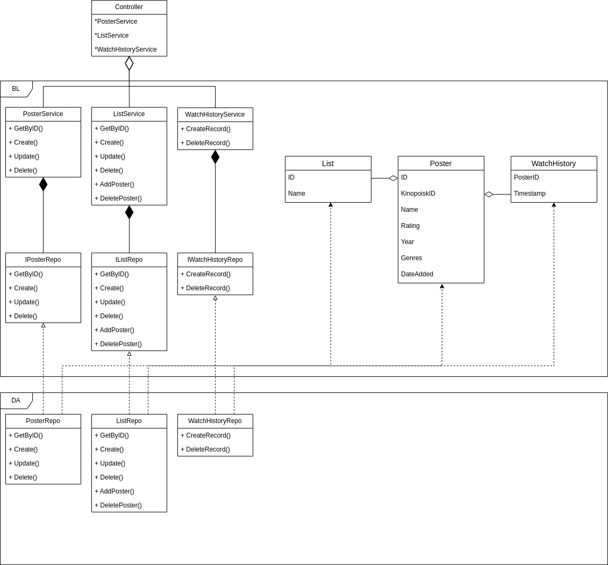

# Приложение для управления списка отложенных для просмотра фильмов и сериалов

## Краткое описание идеи проекта

Краткое описание идеи проекта
Приложение предназначено для более удобного хранения и управления иерархичным списка отложенных для просмотра фильмов, сериалов, книг и игр. Приложение также предоставляет историю просмотренных фильмов и сериалов.

## Краткое описание предметной области

Предметная область - список фильмов и сериалов: добавление нового фильма или сериала в форме постера, создание и управление (CRUD) пользовательским списком из таких постеров.

- Сущность __Постер__ содержит информацию о фильме или сериале: название, год, оценка, жанры.
- Сущность __Список__ содержит название и ссылку на родительский список.
- Сущность __История Просмотров__ содержит пары <постер, дата просмотра>

## Краткий анализ аналогичных решений по 3-м критериям

|  Название  | Создание своих списков с отображаемыми постерами | Удобность управления списком: изменения порядка, создание подсписков |       Список истории просмотренных фильмов       |
|:----------:|:------------------------------------------------:|:--------------------------------------------------------------------:|:------------------------------------------------:|
| Letterboxd |                         +                        |                                   -                                  | - (список есть, но отображется по одному фильму) |
|   myshows  |              + (по платной подписке)             |                                   -                                  |                         +                        |

## Краткое обоснование целесообразности и актуальности проекта

Рассмотренные выше решения не предоставляют удобную работу с пользовательскими списками и не все решения предоставляют историю просмотров.

## Краткое описание акторов (ролей)

- Пользователь - хранится вся информация, используемая в логике приложения. Имеет свою учетную запись.

## Use-Case

## ER

## Пользовательские сценарии

1. Зарегистрироваться/авторизоваться
2. Добавить новый постер, книгу или игру
3. Управление своим списком: создать, посмотреть, редактировать, удалить
4. Управление существующим постером: переместить в список, изменить порядок в списке, отметить просмотренным, удалить
5. Посмотреть пользовательскую историю просмотров

## Формализация бизнес-правил, BPMN-диаграмма

## Описание типа приложения и технологического стека

Тип приложения - REST API Web-server.

### Технологический стек

- Язык программирования: `Golang`,
- СУБД: `PostgreSQL`

## Верхнеуровневое разбиение на компоненты

## UML диаграмма классов приложения

