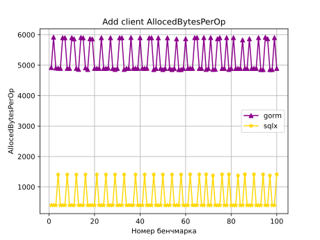
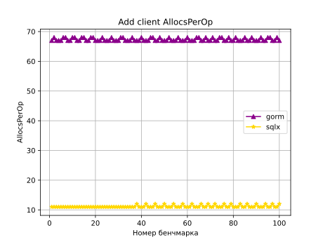
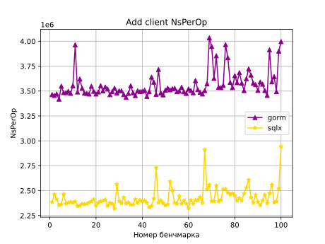
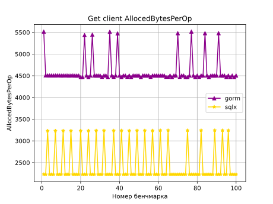
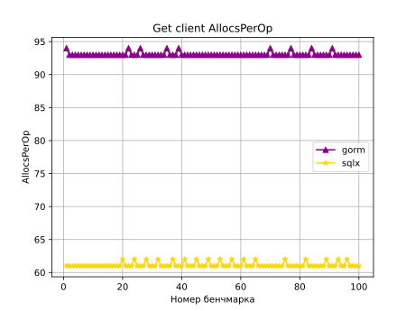
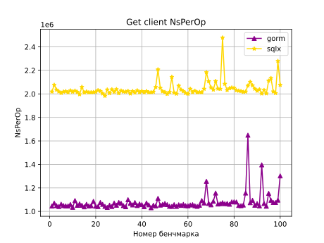
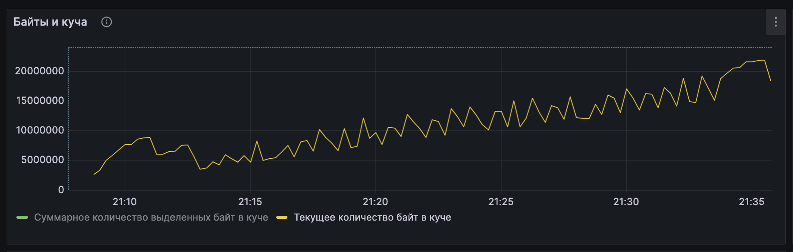

## Benchmark!

Сравнивались библиотеки для выполнения SQL запросов: [SQLX](https://pkg.go.dev/github.com/jmoiron/sqlx) и [GORM](https://gorm.io/)

Для этого были переписаны 2 метода клиентского репозитория -- на добавление клиента и получения данных о клиенте (backend/internal/repository/postgres_repo/benchmark) и отдельный мини-сервер (backend/cmd/bench)

На каждый из 100 запусков бенчамрка выполняется поднятие контейнера с помощью [testcontainers](https://golang.testcontainers.org/), инициализируется база данных и выполняются запросы

Результаты:
```
gorm.AddClient -- runs  100 times CPU: 4105089 ns/op RAM: 68 allocs/op  5935 bytes/op
gorm.GetClient -- runs  100 times CPU: 1054461 ns/op RAM: 93 allocs/op  4508 bytes/op

sqlx.AddClient -- runs  100 times CPU: 2551028 ns/op RAM: 11 allocs/op   401 bytes/op
sqlx.GetClient -- runs  100 times CPU: 2413497 ns/op RAM: 61 allocs/op  2230 bytes/op
```

Картиночки со сравнением:








Картиночки из графаны с ресурсами:




### Запуск
Для запуска нужно выполнить:
```
docker-compose -f docker-compose-bench.yaml up -d
```

убедиться, что postgres, backend, grafana и prometheus поднялись 
чтобы начать бенчмарк нужно выполнить ```curl http://localhost:8081/bench``` и лучше перенаправить вывод в файл result.txt

для обработки результатов надо запустить скрипт bench.py

